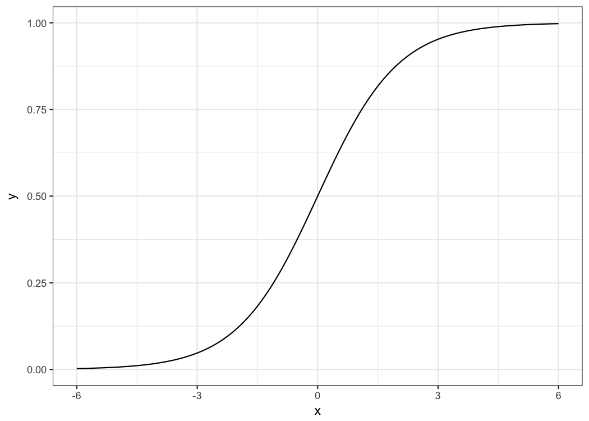

## Logistic Regression {#logistic}
Logistic regression is the linear regression model made fit for classification problems.

### What's Wrong with Linear Regression Models for Classification?
The  linear regression model works well in regression setups, but fails in the classification case.
Why is that?
In case of two classes, you could label one of the classes with 0 and the other with 1 and use a linear model on it and it would estimate the weights for you.
There are just a few problems with that approach:

- A linear model does not output probabilities, but it treats the classes as numbers (0 and 1) and fits the best hyperplane (if you have one feature, it's a line) that minimises the distances between the points and the hyperplane.
So it simply interpolates between the points, but there is no meaning in it and you cannot interpret it as probabilities.
- Also a linear model will extrapolate the features and give you values below zero and above one, which are not meaningful and should tell you that there might be a more clever approach to classification.
- Since the predicted outcome is not a probability but some linear interpolation between points there is no meaningful threshold at which you can distinguish one class from the other.
A good illustration of this issue was given on [Stackoverflow](https://stats.stackexchange.com/questions/22381/why-not-approach-classification-through-regression)
- Linear models don't extend to classification problems with multiple classes.
You would have to start labeling the next class with a 2, then 3 and so on.
The classes might not have any meaningful order, but the linear model would force a weird structure on the relationship between the features and your class predictions.
So for a feature with a positive weight, the higher the value of that feature the more it contributes to the prediction of a class with a higher number, even if classes that happened to get a similar number are not related at all.

![An illustration why linear regression does not work well in a binary classification setting. A linear model is fitted on artificial data for classifying a tumour as malignant (1) or benign (0), dependant on the size of the tumour. Each point is a tumour, the x-axis shows the size of the tumour, the y-axis the malignancy, points are slightly jittered to reduce over-plotting. The lines display the fitted curve from a linear model. In the data setting on the left, we can use 0.5 as a threshold for the predicted outcome of the linear model for separating benign from malignant tumours. After introducing a few more malignant tumour cases, especially with larger tumour sizes, the regression line shifts and a threshold of 0.5 does not separate the classes any longer.](images/linear-class-threshold-1.png)

### Logistic Regression
A solution for classification is logistic regression.
Instead of fitting a straight line or hyperplane, the logistic regression model uses a non-linear function, the logistic function to squeeze the output of a linear equation between 0 and 1.
The logistic function is defined as:

{$$}\text{logistic}(\eta)=\frac{1}{1+exp(-\eta)}{/$$}

And it looks like this:

The step from linear regression models to logistic regression is kind of straightforward. In the linear regression model we modelled the relationship between the outcome and the features with a linear equation:

{$$}\hat{y}_{i}=\beta_{0}+\beta_{1}x_{i,1}+\ldots+\beta_{p}x_{i,p}{/$$}

For the classification we prefer probabilities, which are between 0 and 1, so we wrap the right side of the equation into the logistic regression function and like that force the output to only take on values between 0 and 1.

{$$}P(y_{i}=1)=\frac{1}{1+exp(-(\beta_{0}+\beta_{1}x_{i,1}+\ldots+\beta_{p}x_{i,p}))}{/$$}

Let's revisit the tumour size example again.
But instead of the linear regression model, we use the logistic regression model:

It works better with logistic regression and we can use 0.5 as a threshold in both cases. Including the additional points does not affect the estimated curve much.

### Interpretation
The interpretation of the logistic regression weights differs from the linear regression case, because in logistic regression the outcome is a probability between 0 and 1, and the weights don't affect the probability linearly, but are squeezed through the logistic function.
That's why we need to reformulate the equation for the interpretation, so that there is only the linear term left on the right side of the formula.

{$$}log\left(\frac{P(y_{i}=1)}{1-P(y_{i}=1)}\right)=log\left(\frac{P(y_{i}=1)}{P(y_{i}=0)}\right)=\beta_{0}+\beta_{1}x_{i,1}+\ldots+\beta_{p}x_{i,p}{/$$}

We call the inner term odds (probability of event divided by probability of no event): 

{$$}\frac{P(y_{i}=1)}{1-P(y_{i}=1)}{/$$}
and wrapped in the logarithm it is called log odds:

{$$}log\left(\frac{P(y_{i}=1)}{1-P(y_{i}=1)}\right){/$$}

So with a logistic regression model we have a linear model for the log odds.
Great!
Doesn't sound helpful!
Well, with a bit of shuffling again, you can find out how the prediction changes, when one of the features {$$}x_j{/$$} is changed by 1 point.
For this we can first apply the {$$}exp(){/$$} function on both sides of the equation:

{$$}\frac{P(y_{i}=1)}{(1-P(y_{i}=1))}=odds_i=exp\left(\beta_{0}+\beta_{1}x_{i,1}+\ldots+\beta_{p}x_{i,p}\right){/$$}

Then we compare what happens when we increase one of the {$$}x_{i,j}{/$$} by 1.
But instead of looking at the difference, we look at the ratio of the two predictions:

{$$}\frac{odds_{i,x_j+1}}{odds_i}=\frac{exp\left(\beta_{0}+\beta_{1}x_{i,1}+\ldots+\beta_{j}(x_{i,j}+1)+\ldots+\beta_{p}x_{i,p}\right)}{exp\left(\beta_{0}+\beta_{1}x_{i,1}+\ldots+\beta_{j}x_{i,j}+\ldots+\beta_{p}x_{i,p}\right)}{/$$}

Using the rule that:

{$$}\frac{exp(a)}{exp(b)}=exp(a-b){/$$} 

and removing lots of terms gives us:

{$$}\frac{odds_{i,x_j+1}}{odds_i}=exp\left(\beta_{j}(x_{i,j}+1)-\beta_{j}x_{i,j}\right)=exp\left(\beta_j\right){/$$}

And we end up with something simple like {$$}\exp(\beta_j){/$$}.
So a change of {$$}x_j{/$$} by one unit changes the odds ratio (multiplicatively) by a factor of {$$}\exp(\beta_j){/$$}.
We could also interpret it this way:
A change in {$$}x_j{/$$} by one unit changes the log odds ratio by {$$}\beta_j{/$$} units, but most people do the former because thinking about the {$$}log(){/$$} of something is known to be hard on the brain.
Interpreting the odds ratio already needs a bit of getting used to.
For example if you have odds of 2, it means that the probability for {$$}y_i=1{/$$} is twice as big as {$$}y_i=0{/$$}.
If you have a {$$}\beta_j{/$$} (=odds ratio) of {$$}0.7{/$$}, then an increase in the respective {$$}x_j{/$$} by one unit multiplies the odds by {$$}\exp(0.7)\approx2{/$$} and the odds change to 4.
But usually you don't deal with the odds and only interpret the {$$}\beta{/$$}'s as the odds ratios.
Because for actually calculating the odds you would need to set a value for each feature {$$}x_j{/$$}, which only makes sense if you want to look at one specific instance of your dataset.

Here are the interpretations for the logistic regression model with different feature types:

- Numerical feature: For an increase of one unit of the feature {$$}x_{j}{/$$}, the estimated odds change (multiplicatively) by a factor of {$$}\exp(\beta_{j}){/$$}
- Binary categorical feature: One of the two values of the feature is the reference level (in some languages the one that was coded in 0).
A change of the feature {$$}x_{j}{/$$} from the reference level to the other level changes the estimated odds (multiplicatively) by a factor of {$$}\exp(\beta_{j}){/$$}
- Categorical feature with many levels: One solution to deal with many possible feature values is to one-hot-encode them, meaning each level gets its own column.
From a categorical feature with L levels, you only need L-1 columns, otherwise it is over-parameterised. The interpretation for each level is then according to the binary features.
- Intercept {$$}\beta_{0}{/$$}: Given all numerical features are zero and the categorical features are at the reference level, the estimated odds are {$$}\exp(\beta_{0}){/$$}.
The interpretation of {$$}\beta_{0}{/$$} is usually not relevant.

### Example
We use the logistic regression model to predict [cervical cancer](#cervical) given some risk factors.
The following table shows the estimate weights, the associated odds ratios and the standard error of the estimates:

|                            | Weight| Odds ratio| Std. Error|
|:---------------------------|------:|----------:|----------:|
|Intercept                   |   2.91|      18.36|       0.32|
|Hormonal contraceptives y/n |   0.12|       1.12|       0.30|
|Smokes y/n                  |  -0.26|       0.77|       0.37|
|Num. of pregnancies         |  -0.04|       0.96|       0.10|
|Num. of diagnosed STDs      |  -0.82|       0.44|       0.33|
|Intrauterine device y/n     |  -0.62|       0.54|       0.40|

Interpretation of a numerical feature ('Num. of diagnosed STDs'):
An increase of the number of diagnosed STDs (sexually transmitted diseases) changes (decreases) the odds for cancer vs. no cancer multiplicatively by 0.44, given all other features stay the same.
Keep in mind that correlation does not imply causation.
No recommendation here to get STDs.

Interpretation of a categorical feature ('Hormonal contraceptives y/n'):
For women with hormonal contraceptives, the odds for cancer vs. no cancer are by a factor of 1.12 higher, compared to women without hormonal contraceptives, given all other features stay the same.

Again as in the linear models, the interpretations are always coming with the clause that 'all other features stay the same'.
