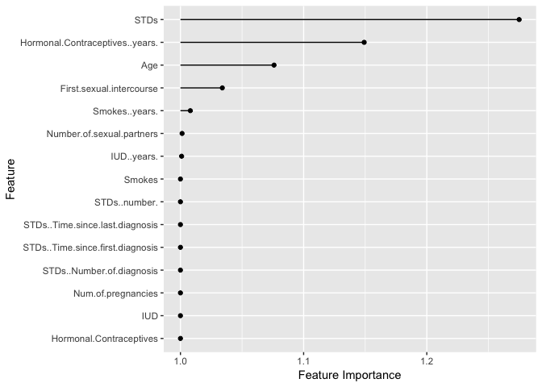
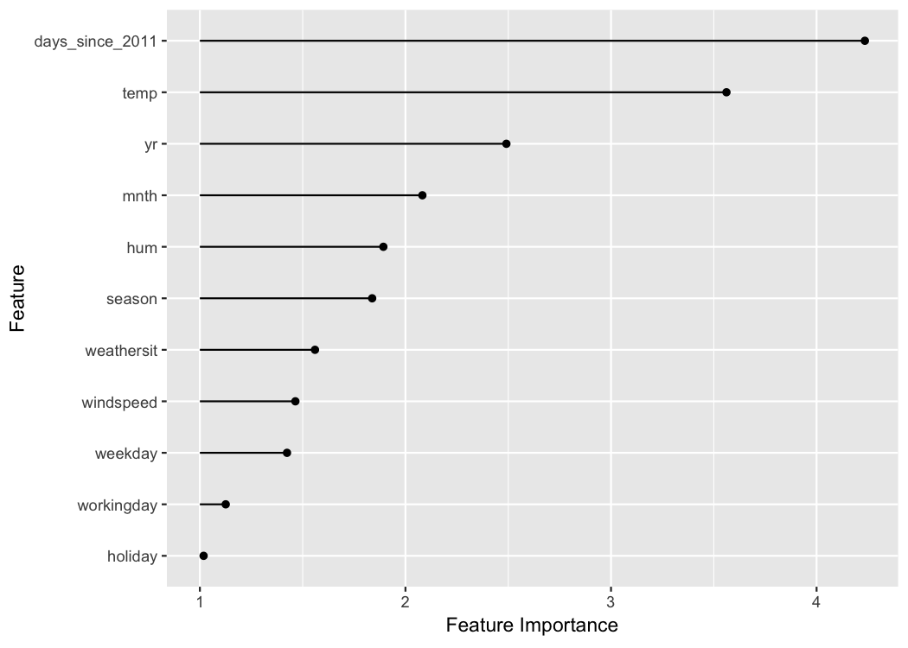

    devtools::load_all("../")

    ## Loading iml.book

    ## Loading required package: knitr

    ## Warning: package 'knitr' was built under R version 3.4.3

    ## Warning: replacing previous import 'BBmisc::isFALSE' by
    ## 'backports::isFALSE' when loading 'mlr'

    ## Warning in as.POSIXlt.POSIXct(Sys.time()): unknown timezone 'zone/tz/2018c.
    ## 1.0/zoneinfo/Europe/Berlin'

    ## Warning: package 'tm' was built under R version 3.4.3

    ## Loading required package: NLP

    ## Loading required package: ParamHelpers

    ## 
    ## Attaching package: 'dplyr'

    ## The following objects are masked from 'package:stats':
    ## 
    ##     filter, lag

    ## The following objects are masked from 'package:base':
    ## 
    ##     intersect, setdiff, setequal, union

    ## 
    ## Attaching package: 'ggplot2'

    ## The following object is masked from 'package:NLP':
    ## 
    ##     annotate

    ## Warning: package 'tidyr' was built under R version 3.4.3

    ## Warning: package 'partykit' was built under R version 3.4.3

    ## Loading required package: grid

    ## Loading required package: libcoin

    ## Warning: package 'libcoin' was built under R version 3.4.3

    ## Loading required package: mvtnorm

    ## Warning: package 'pre' was built under R version 3.4.3

Feature Importance
------------------

A feature's importance is the increase in the model's prediction error
after we permuted the feature's values (breaks the relationship between
the feature and the outcome).

### The Theory

The concept is really straightforward: We measure a feature's importance
by calculating the increase of the model's prediction error after
permuting the feature. A feature is "important", if permuting its values
increases the model error, because the model relied on the feature for
the prediction; A feature is "unimportant" if permuting its values keeps
the model error unchanged, because the model ignored the feature for the
prediction. The permutation feature importance measurement was
introduced for Random Forests by @breiman2001random. Based on this idea,
@Fisher2018 proposed a model-agnostic version of the feature importance
- they called it model reliance. They also introduce more advanced ideas
about feature importance, for example a (model-specific) version that
accounts for the fact that many prediction models may fit the data well.
Their paper is worth a read.

**The algorithm: **

Input: Trained model $\\hat{f}$, feature matrix *X*, target vector *Y*,
error measure $L(Y,\\hat{Y})$

1.  Estimate the original model error
    $e\_{orig}(\\hat{f}) = L(Y, \\hat{f}(X))$ (e.g. mean squared error)
2.  For each feature *j* ∈ 1, …, *p* do
    -   Generate feature matrix *X**p**e**r**m**j*
        by permuting feature *X**j* in *X*. This breaks the
        association between *X**j* and *Y*.
    -   Estimate error $e\_{perm} = L(Y, \\hat{f}(X\_{perm\_j}))$ based
        on the predictions of the permuted data.
    -   Calculate permutation feature importance
        $FI\_j = e\_{perm}(\\hat{f}) / e\_{orig}(\\hat{f})$.
        Alternatively, the difference can be used:
        $FI\_j = e\_{perm}(\\hat{f}) - e\_{orig}(\\hat{f})$
3.  Sort variables by descending *F**I*.

In their paper, @Fisher2018 propose to split the dataset in half and
exchange the *X**j* values of the two halves instead of
permuting *X**j*. This is exactly the same as permuting the
feature *X**j* if you think about it. If you want to have a
more accurate estimate, you can estimate the error of permuting
*X**j* by pairing each instance with the *X**j*
value of each other instance (except with itself). This gives you a
dataset of size *n*(*n* − 1) to estimate the permutation error and it
takes a big amount of computation time. I can only recommend using the
*n*(*n* − 1) - method when you are serious about getting extremely
accurate estimates.

### Example and Interpretation

We show examples for classification and regression.

**Cervical cancer (Classification)**

We fit an xgboost model to predict cervical cancer (data described in
Chapter @ref(cervical)). We measure the error increase by: 1 − *A**U**C*
(one minus the area under the ROC curve). Figure
@ref(fig:importance-cervical) and Table
@ref(tab:importance-cervical-table) show the results. Features that are
associated model error increase by a factor of 1 (= no change) were not
important for predicting cervical cancer.

The importance for each of the features in predicting cervical cancer
with an xgboost model.

<table>
<caption>The feature importance of an xgboost model predicting cervical cancer. The original model error is 0.340 (1 - AUC). The 'error'-column shows the error after feature permutation. The 'importance'-column shows the factor by which the error is increased compared to the original model error.</caption>
<thead>
<tr class="header">
<th align="left">feature</th>
<th align="right">original.error</th>
<th align="right">permutation.error</th>
<th align="right">importance</th>
</tr>
</thead>
<tbody>
<tr class="odd">
<td align="left">STDs</td>
<td align="right">0.34</td>
<td align="right">0.43</td>
<td align="right">1.27</td>
</tr>
<tr class="even">
<td align="left">Hormonal.Contraceptives..years.</td>
<td align="right">0.34</td>
<td align="right">0.39</td>
<td align="right">1.15</td>
</tr>
<tr class="odd">
<td align="left">Age</td>
<td align="right">0.34</td>
<td align="right">0.37</td>
<td align="right">1.08</td>
</tr>
<tr class="even">
<td align="left">First.sexual.intercourse</td>
<td align="right">0.34</td>
<td align="right">0.35</td>
<td align="right">1.03</td>
</tr>
<tr class="odd">
<td align="left">Smokes..years.</td>
<td align="right">0.34</td>
<td align="right">0.34</td>
<td align="right">1.01</td>
</tr>
<tr class="even">
<td align="left">Number.of.sexual.partners</td>
<td align="right">0.34</td>
<td align="right">0.34</td>
<td align="right">1.00</td>
</tr>
<tr class="odd">
<td align="left">IUD..years.</td>
<td align="right">0.34</td>
<td align="right">0.34</td>
<td align="right">1.00</td>
</tr>
<tr class="even">
<td align="left">Hormonal.Contraceptives</td>
<td align="right">0.34</td>
<td align="right">0.34</td>
<td align="right">1.00</td>
</tr>
<tr class="odd">
<td align="left">IUD</td>
<td align="right">0.34</td>
<td align="right">0.34</td>
<td align="right">1.00</td>
</tr>
<tr class="even">
<td align="left">Num.of.pregnancies</td>
<td align="right">0.34</td>
<td align="right">0.34</td>
<td align="right">1.00</td>
</tr>
<tr class="odd">
<td align="left">STDs..Number.of.diagnosis</td>
<td align="right">0.34</td>
<td align="right">0.34</td>
<td align="right">1.00</td>
</tr>
<tr class="even">
<td align="left">STDs..Time.since.first.diagnosis</td>
<td align="right">0.34</td>
<td align="right">0.34</td>
<td align="right">1.00</td>
</tr>
<tr class="odd">
<td align="left">STDs..Time.since.last.diagnosis</td>
<td align="right">0.34</td>
<td align="right">0.34</td>
<td align="right">1.00</td>
</tr>
<tr class="even">
<td align="left">STDs..number.</td>
<td align="right">0.34</td>
<td align="right">0.34</td>
<td align="right">1.00</td>
</tr>
<tr class="odd">
<td align="left">Smokes</td>
<td align="right">0.34</td>
<td align="right">0.34</td>
<td align="right">1.00</td>
</tr>
</tbody>
</table>

The feature with the highest importance was associated with an error
increase of 1.27 after permutation.

**Bike rentals (Classification)**

We fit a random forest model to predict bike rentals, given weather
conditions and calendric information (data described in Chapter
@ref(bike-data)). As error measurement we use the mean absolute error.
Figure @ref(fig:importance-bike) and Table
@ref(tab:importance-bike-table) show the estimated feature importance
values.

The importance for each of the features in predicting bike rentals with
a random forest.

<table>
<caption>The feature importance of a Random Forest predicting bike rentals. It's measured as relative increase in mean absolute error (mae) after feature permutation. The mean absolute error of the model is 210.121. The 'error'-column shows the absolute error after feature permutation. The 'importance'-column shows the factor by which the error is increased compared to the original model error.</caption>
<thead>
<tr class="header">
<th align="left">feature</th>
<th align="right">original.error</th>
<th align="right">permutation.error</th>
<th align="right">importance</th>
</tr>
</thead>
<tbody>
<tr class="odd">
<td align="left">days_since_2011</td>
<td align="right">210.12</td>
<td align="right">882.81</td>
<td align="right">4.20</td>
</tr>
<tr class="even">
<td align="left">temp</td>
<td align="right">210.12</td>
<td align="right">749.02</td>
<td align="right">3.56</td>
</tr>
<tr class="odd">
<td align="left">yr</td>
<td align="right">210.12</td>
<td align="right">527.53</td>
<td align="right">2.51</td>
</tr>
<tr class="even">
<td align="left">mnth</td>
<td align="right">210.12</td>
<td align="right">458.07</td>
<td align="right">2.18</td>
</tr>
<tr class="odd">
<td align="left">hum</td>
<td align="right">210.12</td>
<td align="right">388.12</td>
<td align="right">1.85</td>
</tr>
<tr class="even">
<td align="left">season</td>
<td align="right">210.12</td>
<td align="right">368.43</td>
<td align="right">1.75</td>
</tr>
<tr class="odd">
<td align="left">weathersit</td>
<td align="right">210.12</td>
<td align="right">338.47</td>
<td align="right">1.61</td>
</tr>
<tr class="even">
<td align="left">weekday</td>
<td align="right">210.12</td>
<td align="right">304.05</td>
<td align="right">1.45</td>
</tr>
<tr class="odd">
<td align="left">windspeed</td>
<td align="right">210.12</td>
<td align="right">303.10</td>
<td align="right">1.44</td>
</tr>
<tr class="even">
<td align="left">workingday</td>
<td align="right">210.12</td>
<td align="right">234.47</td>
<td align="right">1.12</td>
</tr>
<tr class="odd">
<td align="left">holiday</td>
<td align="right">210.12</td>
<td align="right">215.82</td>
<td align="right">1.03</td>
</tr>
</tbody>
</table>

A positive aspect of using the error ratio instead of the error
difference is that the feature importance measurements are comparable
across different problems. You can see that the importance of the most
important features in the bike rental prediction task is 2 to 3 times
higher than in the cervical cancer prediction task. This indicates that
the features were much more informative in the bike rental prediction
task and that the bike model does a better job at predicting bike
rentals compared to the cancer model at predicting cancer.

### Advantages

-   Nice interpretation: Feature importance is the increase of model
    error when the feature's information is destroyed.
-   Feature importance provides a highly compressed, global insight into
    the model's behaviour.

### Disadvantages

-   The feature importance measure is tied to the error of the model.
    This is not inherently bad, but in some cases not what you need. In
    some cases you would prefer to know how much the model's output
    varies for one feature, ignoring what it means for the performance.
    For example: You want to find out how robust your model's output is,
    given someone manipulates the features. In this case, you wouldn't
    be interested in how much the model performance drops given the
    permutation of a feature, but rather how much of the model's output
    variance is explained by each feature. Model variance (explained by
    the features) and feature importance correlate strongly, when the
    model generalizes well (i.e. it doesn't overfit).
-   You need access to the actual outcome target. If someone only gives
    you the model and unlabeled data - but not the actual target- you
    can't compute the permutation feature importance.
