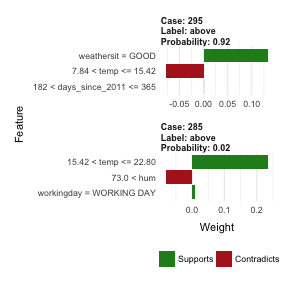
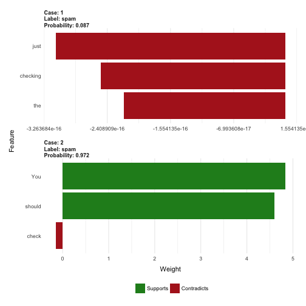

    devtools::load_all("../")

    ## Loading iml.book

    ## Loading required package: knitr

    ## Warning: package 'knitr' was built under R version 3.4.3

    ## Warning: replacing previous import 'BBmisc::isFALSE' by
    ## 'backports::isFALSE' when loading 'mlr'

    ## Warning in as.POSIXlt.POSIXct(Sys.time()): unknown timezone 'zone/tz/2018c.
    ## 1.0/zoneinfo/Europe/Berlin'

    ## Warning: package 'tm' was built under R version 3.4.3

    ## Loading required package: NLP

    ## Loading required package: ParamHelpers

    ## 
    ## Attaching package: 'dplyr'

    ## The following objects are masked from 'package:stats':
    ## 
    ##     filter, lag

    ## The following objects are masked from 'package:base':
    ## 
    ##     intersect, setdiff, setequal, union

    ## 
    ## Attaching package: 'ggplot2'

    ## The following object is masked from 'package:NLP':
    ## 
    ##     annotate

    ## Warning: package 'tidyr' was built under R version 3.4.3

    ## Warning: package 'partykit' was built under R version 3.4.3

    ## Loading required package: grid

    ## Loading required package: libcoin

    ## Warning: package 'libcoin' was built under R version 3.4.3

    ## Loading required package: mvtnorm

    ## Warning: package 'pre' was built under R version 3.4.3

Local Surrogate Models (LIME)
-----------------------------

Local interpretable model-agnostic explanations (LIME) is a method for
fitting local, interpretable models that can explain single predictions
of any black-box machine learning model. LIME explanations are local
surrogate models. Surrogate models are interpretable models (like a
linear model or decision tree) that are learned on the predictions of
the original black box model. But instead of trying to fit a global
surrogate model, LIME focuses on fitting local surrogate models to
explain why single predictions were made.

The idea is quite intuitive. First of all, forget about the training
data and imagine you only have the black box model where you can input
data points and get the models predicted outcome. You can probe the box
as often as you want. Your goal is to understand why the machine
learning model gave the outcome it produced. LIME tests out what happens
to the model's predictions when you put feed variations of your data
into the machine learning model. LIME generates a new dataset consisting
of perturbed samples and the associated black box model's predictions.
On this dataset LIME then trains an interpretable model weighted by the
proximity of the sampled instances to the instance of interest. The
interpretable model can basically be anything from Section @ref(simple),
for example LASSO (see Chapter @ref(lasso)) or a decision tree (Chapter
@ref(tree)). The learned model should be a good approximation of the
machine learning model locally, but it does not have to be so globally.
This kind of accuracy is also called local fidelity.

The recipe for fitting local surrogate models:

-   Choose your instance of interest for which you want to have an
    explanation of its black box prediction.
-   Perturb your dataset and get the black box predictions for these new
    points.
-   Weight the new samples by their proximity to the instance of
    interest.
-   Fit a weighted, interpretable model on the dataset with the
    variations.
-   Explain prediction by interpreting the local model.

In the current implementations ([R](https://github.com/thomasp85/lime)
and [Python](https://github.com/marcotcr/lime)) for example linear
regression can be chosen as interpretable surrogate model. Upfront you
have to choose *K*, the number of features that you want to have in your
interpretable model. The lower the *K*, the easier the model is to
interpret, higher *K* potentially creates models with higher fidelity.
There are different methods for how to fit models with exactly *K*
features. A solid choice is Lasso, described in Chapter @ref(lasso). A
Lasso model with a high regularisation parameter *λ* yields a model with
only the intercept. By refitting the Lasso models with slowly decreasing
*λ*, one after each other, the features are getting weight estimates
different from zero. When *K* features are in the model, you reached the
desired number of features. Other strategies are forward or backward
selection of features. This means you either start with the full model
(=containing all features) or with a model with only the intercept and
then testing which feature would create the biggest improvement when
added or removed, until a model with *K* features is reached. Other
interpretable models like decision trees are also possible.

As always, the devil's in the details. In a high-dimensional space,
defining a neighbourhood is not trivial. Distance measures are quite
arbitrary and distances in different dimensions (aka features) might not
be comparable at all. How big should the neighbourhood be? If it is too
small, then there might be no difference in the predictions of the
machine learning model at all. LIME currently has a hard coded kernel
and kernel width, which define the neighbourhood, and there is no answer
how to figure out the best kernel or how to find the optimal width. The
other question is: How do you get the variations of the data? This
differs depending on the type of data, which can be either text, an
image or tabular data. For text and image the solution is turning off
and on single words or super-pixels. In the case of tabular data, LIME
creates new samples by perturbing each feature individually, by drawing
from a normal distribution with mean and standard deviation from the
feature.

LIME does a good job in creating selective explanations, which humans
prefer. That's why I see LIME more in applications where the recipient
of the explanation is a lay-person or someone with very little time. It
is not sufficient for complete causal attributions, so I don't see LIME
in compliance scenarios, where you are legally required to fully explain
a prediction. Also for debugging machine learning models it is useful to
have all the reasons instead of a few.

### LIME for Tabular Data

Tabular data means any data that comes in tables, where each row
represents an instance and each column a feature. LIME sampling is not
done around the instance of interest, but from the training data's mass
centre, which is problematic. But it increases the likelihood that the
outcome for some of the sampled points predictions differ from the data
point of interest and that LIME can learn at least some explanation.

Figure @ref(fig:lime-fitting) explains how the sampling and local model
fitting works.

How LIME sampling works: A) The black box model predicts one of two
classes given feature x1 and x2. Most data points have class 0 (darker
colour), and the ones with class 1 are grouped in an upside-down V-shape
(lighter colour). The plot displays the decision boundaries learned by a
machine learning model. In this case it was a Random Forest, but it does
not matter, because LIME is model-agnostic and we only care about the
decision boundaries. B) The yellow point is the instance of interest,
which we want to explain. The black dots are data sampled from a normal
distribution around the means of the features in the training sample.
This needs to be done only once and can be reused for other
explanations. C) Introducing locality by giving points near the instance
of interest higher weights. D) The colours and signs of the grid display
the classifications of the locally learned model form the weighted
samples. The white line marks the decision boundary (P(class) = 0.5) at
which the classification of the local model changes.

#### Example

Let's look at a concrete example. We go back to the bike rental data
described in Chapter @ref(bike-data) and turn the prediction problem
into a classification: After accounting for the trend that the bike
rental get's more popular over time we want to know on a given day if
the number of rented bikes will be above or below the trend line. You
can also interpret 'above' as being above the mean bike counts, but
adjusted for the trend.

First we train a Random Forest with 100 trees on the classification
task. Given seasonal and weather information, on which day will the
number of bike rentals be above the trend-free average?

LIME explanations for two instances of the bike rental dataset.
Temperature and good weather situation have a positive effect on the
prediction, the day of the week and increasing humidity a negative one.
The effect of temperature is roughly the same in both cases. One problem
becomes clear: This plot shows the weights and not the effects, which
would be weights times actual feature values, which would be more
informative.

The explanations are created with 3 features. Figure
@ref(fig:lime-tabular-example-explain-plot-1) shows the results of the
sparse local linear model that was fitted for two instances with
different predicted classes. It becomes clear from the figure, that it
is easier to interpret categorical features than numerical features.
Figure @ref(fig:lime-tabular-example-explain-plot-2) shows a variant
where the numerical features are turned into categorical features by
putting them into bins along the quantiles.

LIME explanations for two instances of the bike rental classification
task. This time numerical features were turned into categorical features
by binning them.

### LIME for Text

LIME for text works differs from LIME for tabular data. Variations of
the data are created differently: Starting from the original text, new
texts are created by randomly removing words from it. The dataset is
represented with binary features for each word. A feature is 1 if the
respective word is included and 0 if it was removed.

#### Example

In this example we classify spam vs. ham of YouTube comments. The
dataset is described in Chapter @ref(spam-data).

The black box model is a decision tree on the document word matrix. Each
comment is one document (= one row) and each column is the number of
occurrences of a specific word. As discussed in Section @ref(simple),
decision trees are easy to understand, but in this case the tree is very
deep. Also in the place of this tree there could have been a recurrent
neural network or a support vector machine that was trained on the
embeddings from word2vec. From the remaining comments two were selected
for showing the explanations.

Let's look at two comments of this dataset and the corresponding
classes:

<table>
<thead>
<tr class="header">
<th></th>
<th align="left">CONTENT</th>
<th align="right">CLASS</th>
</tr>
</thead>
<tbody>
<tr class="odd">
<td>24</td>
<td align="left">just checking the views</td>
<td align="right">0</td>
</tr>
<tr class="even">
<td>9</td>
<td align="left">You should check my channel for Funny VIDEOS!!</td>
<td align="right">1</td>
</tr>
</tbody>
</table>

In the next step we create some variations of the datasets, which are
used in a local model. For example some variations of one of the
comments:

<table>
<thead>
<tr class="header">
<th></th>
<th align="right">You</th>
<th align="right">should</th>
<th align="right">check</th>
<th align="right">my</th>
<th align="right">channel</th>
<th align="right">for</th>
<th align="right">Funny</th>
<th align="right">VIDEOS!!</th>
<th align="right">prob</th>
<th align="right">weight</th>
</tr>
</thead>
<tbody>
<tr class="odd">
<td>2</td>
<td align="right">1</td>
<td align="right">0</td>
<td align="right">0</td>
<td align="right">0</td>
<td align="right">1</td>
<td align="right">1</td>
<td align="right">0</td>
<td align="right">1</td>
<td align="right">1.00</td>
<td align="right">0.50</td>
</tr>
<tr class="even">
<td>3</td>
<td align="right">1</td>
<td align="right">1</td>
<td align="right">0</td>
<td align="right">1</td>
<td align="right">1</td>
<td align="right">1</td>
<td align="right">1</td>
<td align="right">1</td>
<td align="right">1.00</td>
<td align="right">0.88</td>
</tr>
<tr class="odd">
<td>4</td>
<td align="right">0</td>
<td align="right">0</td>
<td align="right">0</td>
<td align="right">1</td>
<td align="right">1</td>
<td align="right">1</td>
<td align="right">0</td>
<td align="right">1</td>
<td align="right">1.00</td>
<td align="right">0.50</td>
</tr>
<tr class="even">
<td>5</td>
<td align="right">1</td>
<td align="right">1</td>
<td align="right">0</td>
<td align="right">1</td>
<td align="right">1</td>
<td align="right">1</td>
<td align="right">1</td>
<td align="right">1</td>
<td align="right">1.00</td>
<td align="right">0.88</td>
</tr>
<tr class="odd">
<td>6</td>
<td align="right">1</td>
<td align="right">1</td>
<td align="right">1</td>
<td align="right">1</td>
<td align="right">1</td>
<td align="right">0</td>
<td align="right">0</td>
<td align="right">1</td>
<td align="right">0.97</td>
<td align="right">0.75</td>
</tr>
</tbody>
</table>

Each column corresponds to one word in the sentence. Each row is a
variation, 1 indicates that the word is part of this variation and 0
indicates that the word has been removed. The corresponding sentence for
the first variation is
"`You should my channel for Funny VIDEOS!! prob`". Figure
@ref(fig:lime-text-explanations) shows for two sentences (one spam, one
no spam) the estimated local weights found by the LIME algorithm.

LIME explanations of spam predictions for two Youtube comments. Comment
1: "just checking the views", comment 2: "You should check my channel
for Funny VIDEOS!!"

