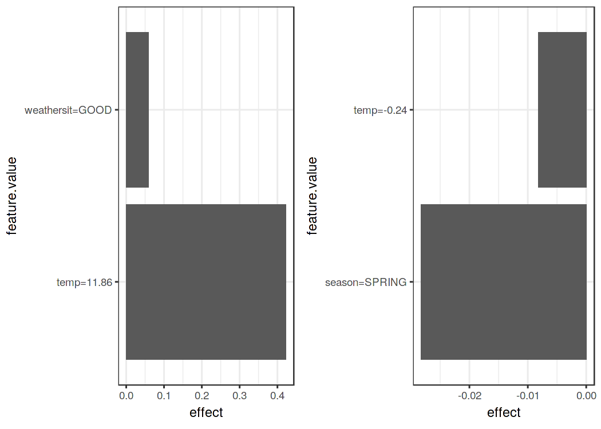

{pagebreak}

## Local Surrogate (LIME) {#lime}

Local surrogate models are interpretable models that are used to explain individual predictions of black box machine learning models.
Local interpretable model-agnostic explanations (LIME)[^Ribeiro2016lime] is a paper in which the authors propose a concrete implementation of local surrogate models.
Surrogate models are trained to approximate the predictions of the underlying black box model.
Instead of training a global surrogate model, LIME focuses on training local surrogate models to explain individual predictions.

The idea is quite intuitive.
First, forget about the training data and imagine you only have the black box model where you can input data points and get the predictions of the model.
You can probe the box as often as you want.
Your goal is to understand why the machine learning model made a certain prediction.
LIME tests what happens to the predictions when you give variations of your data into the machine learning model.
LIME generates a new dataset consisting of permuted samples and the corresponding predictions of the black box model.
On this new dataset LIME then trains an interpretable model, which is weighted by the proximity of the sampled instances to the instance of interest. 
The interpretable model can be anything from the [interpretable models chapter](#simple), for example [Lasso](#lasso) or a [decision tree](#tree).
The learned model should be a good approximation of the machine learning model predictions locally, but it does not have to be a good global approximation.
This kind of accuracy is also called local fidelity.

Mathematically, local surrogate models with interpretability constraint can be expressed as follows:

{$$}\text{explanation}(x)=\arg\min_{g\in{}G}L(f,g,\pi_x)+\Omega(g){/$$}

The explanation model for instance x is the model g (e.g. linear regression model) that minimizes loss L (e.g. mean squared error), which measures how close the explanation is to the prediction of the original model f (e.g. an xgboost model), while the model complexity {$$}\Omega(g){/$$} is kept low (e.g. prefer fewer features).
G is the family of possible explanations, for example all possible linear regression models.
The proximity measure {$$}\pi_x{/$$} defines how large the neighborhood around instance x is that we consider for the explanation.
In practice, LIME only optimizes the loss part.
The user has to determine the complexity, e.g. by selecting the maximum number of features that the linear regression model may use.

The recipe for training local surrogate models:

- Select your instance of interest for which you want to have an explanation of its black box prediction.
- Perturb your dataset and  get the black box predictions for these new points.
- Weight the new samples according to their proximity to the instance of interest.
- Train a weighted, interpretable model on the dataset with the variations.
- Explain the prediction by interpreting the local model.

In the current implementations in [R](https://github.com/thomasp85/lime) and [Python](https://github.com/marcotcr/lime), for example, linear regression can be chosen as interpretable surrogate model.
In advance, you have to select K, the number of features you want to have in your interpretable model.
The lower K, the easier it is to interpret the model.
A higher K potentially produces models with higher fidelity.
There are several methods for training models with exactly K features.
A good choice is [Lasso](#lasso).
A Lasso model with a high regularization parameter {$$}\lambda{/$$} yields a model without any feature.
By retraining the Lasso models with slowly decreasing {$$}\lambda{/$$}, one after the other, the features get weight estimates that differ from zero.
If there are K features in the model, you have reached the desired number of features. 
Other strategies are forward or backward selection of features.
This means you either start with the full model (= containing all features) or with a model with only the intercept and then test which feature would bring the biggest improvement when added or removed, until a model with K features is reached.

How do you get the variations of the data?
This depends on the type of data, which can be either text, image or tabular data. 
For text and images, the solution is to turn single words or super-pixels on or off.
In the case of tabular data, LIME creates new samples by perturbing each feature individually, drawing from a normal distribution with mean and standard deviation taken from the feature.

### LIME for Tabular Data

Tabular data is data that comes in tables, with each row representing an instance and each column a feature.
LIME samples are not taken around the instance of interest, but from the training data's mass center, which is problematic.
But it increases the probability that the result for some of the sample points predictions differ from the data point of interest and that LIME can learn at least some explanation.

It is best to visually explain how sampling and local model training works:

As always, the devil is in the detail.
Defining a meaningful neighborhood around a point is difficult.
LIME currently uses an exponential smoothing kernel to define the neighborhood.
A smoothing kernel is a function that takes two data instances and returns a proximity measure.
The kernel width determines how large the neighborhood is: 
A small kernel width means that an instance must be very close to influence the local model, a larger kernel width means that instances that are farther away also influence the model.
If you look at [LIME's Python implementation (file lime/lime_tabular.py)](https://github.com/marcotcr/lime/tree/ce2db6f20f47c3330beb107bb17fd25840ca4606) you will see that it uses an exponential smoothing kernel (on the normalized data) and the kernel width is 0.75 times the square root of the number of columns of the training data.
It looks like an innocent line of code, but it is like an elephant sitting in your living room next to the good porcelain you got from your grandparents.
The big problem is that we do not have a good way to find the best kernel or width.
And where does the 0.75 even come from?
In certain scenarios, you can easily turn your explanation around by changing the kernel width, as shown in the following figure:

The example shows only one feature.
It gets worse in high-dimensional feature spaces.
It is also very unclear whether the distance measure should treat all features equally.
Is a distance unit for feature x1 identical to one unit for feature x2?
Distance measures are quite arbitrary and distances in different dimensions (aka features) might not be comparable at all.

#### Example

Let us look at a concrete example.
We go back to the [bike rental data](#bike-data) and turn the prediction problem into a classification:
After taking into account the trend that the bicycle rental has become more popular over time, we want to know on a certain day whether the number of bicycles rented will be above or below the trend line.
You can also interpret "above" as being above the average number of bicycles, but adjusted for the trend.

First we train a random forest with 100 trees on the classification task.
On what day will the number of rental bikes be above the trend-free average, based on weather and calendar information?

The explanations are created with 2 features.
The results of the sparse local linear models trained for two instances with different predicted classes:

From the figure it becomes clear that it is easier to interpret categorical features than numerical features.
One solution is to categorize the numerical features into bins.

### LIME for Text

LIME for text differs from LIME for tabular data.
Variations of the data are generated differently:
Starting from the original text, new texts are created by randomly removing words from the original text.
The dataset is represented with binary features for each word.
A feature is 1 if the corresponding word is included and 0 if it has been removed.

#### Example

In this example we classify [YouTube comments](#spam-data) as spam or normal.

The black box model is a deep decision tree trained on the document word matrix.
Each comment is one document (= one row) and each column is the number of occurrences of a given word.
Short decision trees are easy to understand, but in this case the tree is very deep.
Also in place of this tree there could have been a recurrent neural network or a support vector machine trained on word embeddings (abstract vectors).
Let us look at the two comments of this dataset and the corresponding classes (1 for spam, 0 for normal comment):

|    |CONTENT                                 | CLASS|
|:---|:---------------------------------------|-----:|
|267 |PSY is a good guy                       |     0|
|173 |For Christmas Song visit my channel! ;) |     1|

The next step is to create some variations of the datasets used in a local model.
For example, some variations of one of the comments:

|   | For| Christmas| Song| visit| my| channel!| ;)| prob| weight|
|:--|---:|---------:|----:|-----:|--:|--------:|--:|----:|------:|
|2  |   1|         0|    1|     1|  0|        0|  1| 0.09|   0.57|
|3  |   0|         1|    1|     1|  1|        0|  1| 0.09|   0.71|
|4  |   1|         0|    0|     1|  1|        1|  1| 0.99|   0.71|
|5  |   1|         0|    1|     1|  1|        1|  1| 0.99|   0.86|
|6  |   0|         1|    1|     1|  0|        0|  1| 0.09|   0.57|

Each column corresponds to one word in the sentence.
Each row is a variation, 1 means that the word is part of this variation and 0 means that the word has been removed.
The corresponding sentence for one of the variations is "``Christmas Song visit my ;)``".
The "prob" column shows the predicted probability of spam for each of the sentence variations.
The "weight" column shows the proximity of the variation to the original sentence, calculated as 1 minus the proportion of words that were removed, for example if 1 out of 7 words was removed, the proximity is 1 - 1/7 = 0.86.

Here are the two sentences (one spam, one no spam) with their estimated local weights found by the LIME algorithm:

| case| label_prob|feature  | feature_weight|
|----:|----------:|:--------|--------------:|
|    1|  0.0872151|good     |       0.000000|
|    1|  0.0872151|a        |       0.000000|
|    1|  0.0872151|PSY      |       0.000000|
|    2|  0.9939759|channel! |       6.908755|
|    2|  0.9939759|visit    |       0.000000|
|    2|  0.9939759|Song     |       0.000000|

The word "channel" indicates a high probability of spam.
For the non-spam comment no non-zero weight was estimated, because no matter which word is removed, the predicted class remains the same.

### LIME for Images {#images-lime}

*This section was written by Verena Haunschmid.*

LIME for images works differently than LIME for tabular data and text. 
Intuitively, it would not make much sense to perturb individual pixels, since many more than one pixel contribute to one class. 
Randomly changing individual pixels would probably not change the predictions by much.
Therefore, variations of the images are created by segmenting the image into "superpixels" and turning superpixels off or on. 
Superpixels are interconnected pixels with similar colors and can be turned off by replacing each pixel with a user-defined color such as gray.
The user can also specify a probability for turning off a superpixel in each permutation.

#### Example

Since the computation of image explanations is rather slow, the [lime R package](https://github.com/thomasp85/lime) contains a precomputed example which we will also use to show the output of the method. 
The explanations can be displayed directly on the image samples. 
Since we can have several predicted labels per image (sorted by probability), we can explain the top `n_labels`.
For the following image the top 3 predictions were *electric guitar*; *acoustic guitar*; and *Labrador*. 

The prediction and explanation in the first case are very reasonable.
The first prediction of *electric guitar* is of course wrong, but the explanation shows us that the neural network still behaved reasonably because the image part identified suggests that this could be an electric guitar.

### Advantages

Even if you **replace the underlying machine learning model**, you can still use the same local, interpretable model for explanation.
Suppose the people looking at the explanations understand decision trees best.
Because you use local surrogate models, you use decision trees as explanations without actually having to use a decision tree to make the predictions.
For example, you can use a SVM.
And if it turns out that an xgboost model works better, you can replace the SVM and still use as decision tree to explain the predictions.

Local surrogate models benefit from the literature and experience of training and interpreting interpretable models.

When using Lasso or short trees, the resulting **explanations are short (= selective) and possibly contrastive**. 
Therefore, they make [human-friendly explanations](#explanation).
This is why I see LIME more in applications where the recipient of the explanation is a lay person or someone with very little time.
It is not sufficient for complete attributions, so I do not see LIME in compliance scenarios where you might be legally required to fully explain a prediction.
Also for debugging machine learning models, it is useful to have all the reasons instead of a few.

LIME is one of the few methods that **works for tabular data, text and images**.

The **fidelity measure** (how well the interpretable model approximates the black box predictions) gives us a good idea of how reliable the interpretable model is in explaining the black box predictions in the neighborhood of the data instance of interest.

LIME is implemented in Python ([lime](https://github.com/marcotcr/lime) and [Skater](https://github.com/datascienceinc/Skater)) and R ([lime package](https://cran.r-project.org/web/packages/lime/index.html) and [iml package](https://cran.r-project.org/web/packages/iml/index.html)) and is **very easy to use**.

The explanations created with local surrogate models **can use other features than the original model**. 
This can be a big advantage over other methods, especially if the original features cannot bet interpreted. 
A text classifier can rely on abstract word embeddings as features, but the explanation can be based on the presence or absence of words in a sentence.
A regression model can rely on a non-interpretable transformation of some attributes, but the explanations can be created with the original attributes.

### Disadvantages

The correct definition of the neighborhood is a very big, unsolved problem when using LIME with tabular data.
In my opinion it is the biggest problem with LIME and the reason why I would recommend to use LIME only with great care.
For each application you have to try different kernel settings and see for yourself if the explanations make sense.
Unfortunately, this is the best advice I can give to find good kernel widths.

Sampling could be improved in the current implementation of LIME. 
Data points are sampled from a Gaussian distribution, ignoring the correlation between features.
This can lead to unlikely data points which can then be used to learn local explanation models.

The complexity of the explanation model has to be defined in advance.
This is just a small complaint, because in the end the user always has to define the compromise between fidelity and sparsity.

Another really big problem is the instability of the explanations.
In an article [^limerobustness] the authors showed that the explanations of two very close points varied greatly in a simulated setting.
Also, in my experience, if you repeat the sampling process, then the explantions that come out can be different.
Instability means that it is difficult to trust the explanations, and you should be very critical.

Conclusion:
Local surrogate models, with LIME as a concrete implementation, are very promising.
But the method is still in development phase and many problems need to be solved before it can be safely applied.

[^Ribeiro2016lime]: Ribeiro, Marco Tulio, Sameer Singh, and Carlos Guestrin. "Why Should I Trust You?: Explaining the predictions of any classifier." Proceedings of the 22nd ACM SIGKDD international conference on knowledge discovery and data mining. ACM, 2016.

[^limerobustness]: Alvarez-Melis, David, and Tommi S. Jaakkola. "On the Robustness of Interpretability Methods." arXiv preprint arXiv:1806.08049 (2018).
